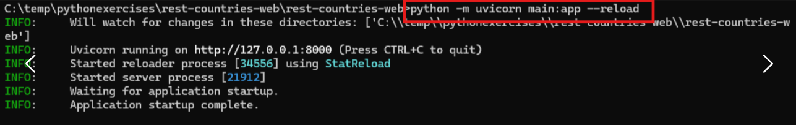
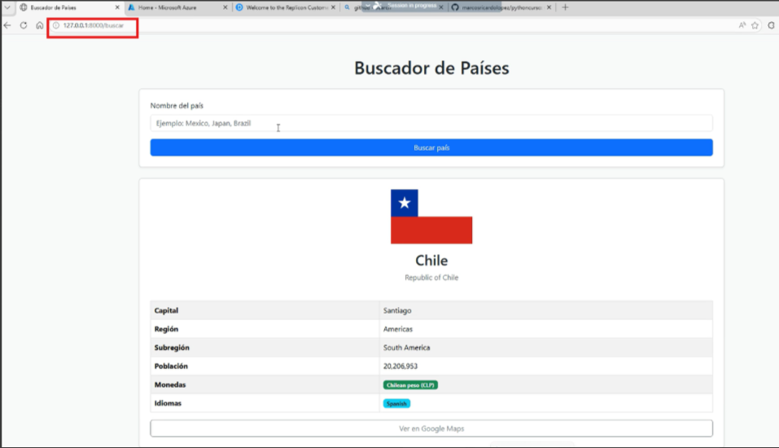

# pythonCurso
# Curso de Python en DXC (Ejercicios y prácticas)

Para correr la funcion de los paises le debn instalar los siguientes paquetes a python:
python -m pip install fastapi uvicorn requests jinja2

Ejecuta el siguiente comando para instalar python-multipart:
pip install python-multipart

Esto instalará la biblioteca python-multipart en tu entorno virtual.
Después de la instalación, verifica que la biblioteca se haya instalado correctamente ejecutando el siguiente comando:
pip list

Deberías ver python-multipart en la lista de paquetes instalados.

Una vez que hayas instalado python-multipart, puedes volver a ejecutar tu código de FastAPI y debería funcionar sin problemas.

-Levantar el servidor de FastAPI:

Para levantar el servidor de FastAPI, sigue estos pasos:
Asegúrate de tener tu entorno virtual de Python activado. Esto es importante para tener las dependencias correctas.
Abre una terminal o la ventana de comandos de tu sistema operativo.
Navega hasta el directorio donde tienes tu archivo main.py de FastAPI.
Una vez en el directorio correcto, ejecuta el siguiente comando para levantar el servidor:

python -m uvicorn main:app --reload

Veamos qué significa cada parte de este comando:

uvicorn: es el servidor ASGI que usarás para ejecutar tu aplicación de FastAPI.
main:app: indica a Uvicorn que tu aplicación FastAPI se define en el archivo main.py y que la instancia de FastAPI se llama app.
--reload: esta opción hace que Uvicorn reinicie automáticamente el servidor cuando detecte cambios en tu código, lo cual es muy útil durante el desarrollo.
Después de ejecutar este comando, deberías ver algo similar a esto en la salida de tu terminal:

INFO:     Uvicorn running on http://127.0.0.1:8000 (Press CTRL+C to quit)
INFO:     Started reloader process [12345] using watchgod
INFO:     Started server process [6789]
INFO:     Waiting for application startup.
INFO:     Application startup complete.
Esto significa que tu servidor de FastAPI se está ejecutando en http://127.0.0.1:8000.

Ahora, puedes abrir tu navegador web y navegar a http://localhost:8000 para ver tu aplicación en funcionamiento.

Si tienes algún otro problema, no dudes en preguntar. Estaré encantado de ayudarte a resolverlo.

Luego correr esta instruccion en el folder donde tienen el codigo con main.py 

y deben de terminar con algo asi en el browser si todo funciona bien, luego le pueden poner diferentes nombres en los paises y les debe dar la informacion de cada pais

INDICE

Week 1:
    -Sintaxis básica
Week 2:
    -Abrir archivos .CSV y recorrerlo para ver y obtener los datos
Week 3:
    -Clases y Objetos
Week 4:
    -Bases de Datos y Tablas
Week 5:
    -WEB SCRAPING PRODUCT PRICES
    -WEB SCRAPING EXAMPLE WITH PYTHON
    -DATABASE SETUP
    -FUNCTION TO GET POKEMON DATA
    -FUNCTION TO SAVE TO DATABASE
    -FUNCTION TO DISPLAY INFO